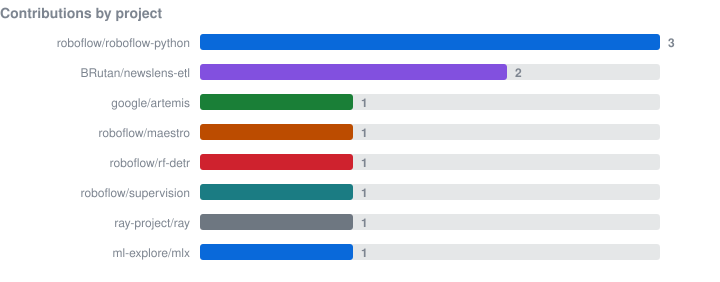
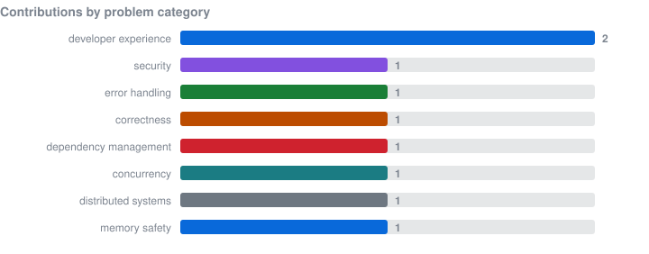
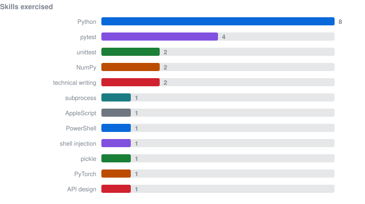

# Statistics

Generated from `data/contributions.json`. Do not edit by hand — run `npm run build`.

## Contributions to projects I don't maintain

| | |
|---|---|
| Contributions | 5 |
| Merged | 1 |
| Open | 3 |
| Closed unmerged | 1 |
| Projects | 4 |
| Lines added | 1,201 |
| Review comments received | 2 |
| Median days to merge | 0 |

| Date | Project | Contribution | Category | Size | Status | PR |
|---|---|---|---|---|---|---|
| 2026-08-27 | [roboflow/supervision](https://github.com/roboflow/supervision) | [fix(detection): merge InferenceSlicer results in source slice order](contributions/roboflow/supervision/2517-merge-inferenceslicer-results-in-source-slice-order) | concurrency | +106/-13 | `open` | [#2517](https://github.com/roboflow/supervision/pull/2517) |
| 2026-08-23 | [ray-project/ray](https://github.com/ray-project/ray) | [\[Core\]\[Jobs\] Use the worker-local GCS client in JobSupervisor](contributions/ray-project/ray/65686-core-jobs-use-the-worker-local-gcs-client-in-jobsupervisor) | distributed systems | +43/-8 | `open` | [#65686](https://github.com/ray-project/ray/pull/65686) |
| 2026-08-23 | [ml-explore/mlx](https://github.com/ml-explore/mlx) | [Validate GGUF tensor dimensions](contributions/ml-explore/mlx/4378-validate-gguf-tensor-dimensions) | memory safety | +135/-13 | `open` | [#4378](https://github.com/ml-explore/mlx/pull/4378) |
| 2026-03-16 | [BRutan/newslens-etl](https://github.com/BRutan/newslens-etl) | Added logging across pipeline stages, consolidated shared utilities, … | — | +576/-283 | `closed` | [#2](https://github.com/BRutan/newslens-etl/pull/2) |
| 2026-03-16 | [BRutan/newslens-etl](https://github.com/BRutan/newslens-etl) | Elevate README and EXPLAIN to showcase-quality docs | — | +341/-143 | `merged` | [#1](https://github.com/BRutan/newslens-etl/pull/1) |

## Why my own repositories are counted separately

A pull request to a repository I maintain is not the same thing as one accepted
by a project I don't control. Combining them would report a larger number that
anyone clicking through would immediately discount, which costs more credibility
than the number is worth.

My own open-source projects are described in [projects/](projects/).

*Last synced 2026-08-27.*
